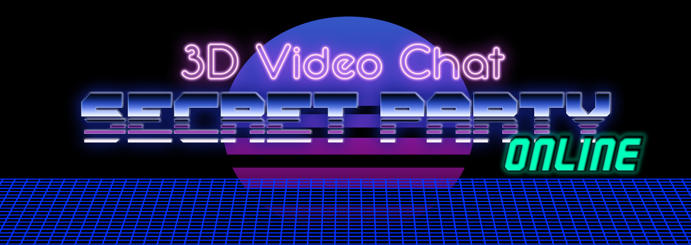

	
	<h1>🌈 Online socials as they should be 🌈 </h1>
	 
	  <i>COMING SOON: Youtube teaser</i>
	 
	 

#### Built with
 
   

    
  

And also:
- coturn
- signalhub
- webrtc-swarm

 
## Milestones
🎉🎉🎉 We had a party of 15 people!!! 🎉🎉🎉

The next upcoming features I'd like to see realised:
- 🌍 go public,
- 👨‍👩‍👧‍👦 support rooms above 20 people to possible 100.

❤️❤️❤️ You can [contribute](#contributing) or [sponsor](#sponsoring) the project to help achieve these goals! ❤️❤️❤️

## How to use it
🥺 Sorry, there is no public deployment yet.     

🛠 You can follow the procedure at [DEPLOY_TO_GCP.md](docs/DEPLOY_TO_GCP.md) to create your private instance.  
_[Contact me](#contacts) if you need help with that._

## Contributing
👐 [CONTRIBUTING.md](docs/CONTRIBUTING.md)

## Sponsoring
♪♬♩ _Toss a coin to your dev..._ ♪♬♩  
 **Bitcoin**  👉  _35bbXFXNwqHzyePGnZrcbJDNJaX6kv2Hzd_  
 **Ethereum** 👉 _0xBA42dC3DDbf8bedEFe7C82395C30617AbE08EF35_  

Traditional 🦄? [Sponsor me on GitHub! ❤️](https://github.com/sponsors/mrenrich84)

## License
📝 [LICENSE.md](docs/LICENSE.md)

## Contacts
 [EnricoGraz84](https://twitter.com/EnricoGraz84)  
 [r/secretParty3d](https://www.reddit.com/r/secretParty3d)